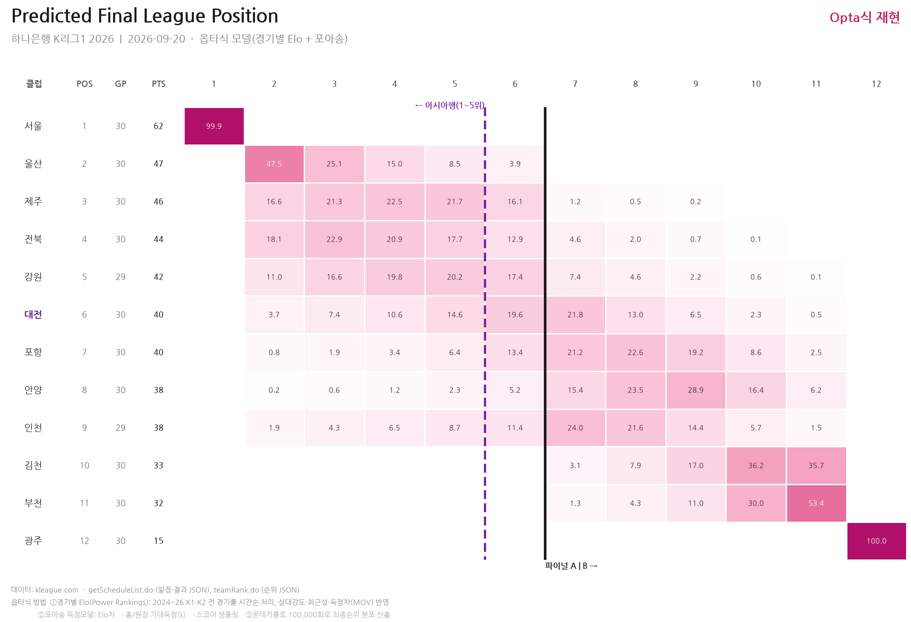
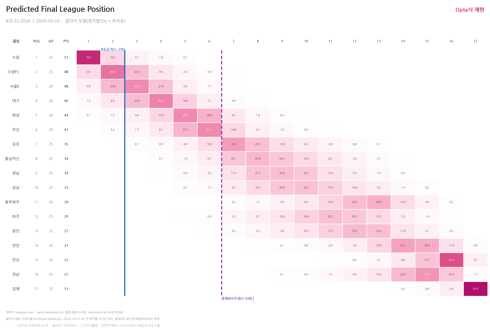

# K League 최종순위 예측 (옵타식 몬테카를로)

K리그1·K리그2의 **최종순위 확률**을 옵타(Opta) 슈퍼컴퓨터 방식으로 시뮬레이션한다.
현재까지의 실제 결과(승점)를 출발점으로, 남은 경기는 **팀 실력(경기별 Elo)**과
**포아송 득점 모델**로 예측해 10만 회 몬테카를로를 돌린 뒤 순위 분포를 집계한다.

데이터는 [kleague.com](https://www.kleague.com) 공식 JSON을 실시간으로 가져오므로,
스크립트만 다시 실행하면 매 라운드 최신 확률이 갱신된다.

**K리그1 최종순위 예측**


**K리그2 최종순위 예측**


## 옵타식 방법

1. **경기별 Elo (Opta Power Rankings식)**
   2024-2026년 **K1·K2 전 경기**를 시간순으로 처리하며 레이팅을 갱신한다.
   - 상대 강도 반영(강팀을 이기면 더 큰 상승), 최근 경기 가중(자연스러운 시간 흐름)
   - 득점차 가중(MOV, 538식) — 대승일수록 더 크게 반영
   - 시즌 경계에서 평균(1500)으로 30% 회귀 → 다년 폼 + 승강팀 이력 연속 반영
2. **포아송 득점 모델**
   Elo차 → 홈/원정 기대득점(λ) → 스코어 샘플링. 승/무/패뿐 아니라 득실차·다득점까지
   생성해 K리그 규정 타이브레이크(승점 → 다득점 → 득실차 → 다승)를 그대로 적용한다.
3. **몬테카를로 10만 회** → 각 팀의 최종순위 분포 산출.

> 핵심 철학: *"확정된 승점은 출발점, 미래는 성적표가 아니라 실력(퍼포먼스)으로 예측한다."*
> 그래서 득실차·상대강도가 좋은 저평가 팀은 순위표보다 높게 나올 수 있다.

## 리그 구조

| | K리그1 | K리그2 |
|---|---|---|
| 팀 수(2026) | 12 | 17 |
| 스플릿 | **있음** (33R 후 파이널 A/B, 각 5경기) | 없음 (단일 리그 34R) |
| 핵심 경계 | 6/7위(파이널 A) · 5/6위(아시아행) | 1-2위(자동승격) · 3-6위(플레이오프) |

- **K1 스플릿**: 33R까지는 "6위 vs 7위"가 관건(파이널 A 진입). 34R부터는 상위 6팀이
  1-6위로 고정돼, "파이널 A 안에서 5위 이상(아시아행) vs 6위"로 분석이 바뀐다.
  코드는 남은 경기의 라운드 번호로 두 국면을 **자동 판별**한다.
- **K2 승격**: 1-2위는 K1으로 **자동 승격**, 3-6위는 **승격 플레이오프**에 진출한다
  (3위-6위·4위-5위 준PO → 승자끼리 PO → PO 승자가 K1 11위와 승강 PO). 즉 상위 2팀과
  3-6위 4팀의 경계가 핵심이다. (세부 규정은 연도별로 달라질 수 있다.)

## 파일 구성

| 파일 | 설명 |
|---|---|
| `kleague_data.py` | kleague.com 공식 JSON 수집 (순위·일정·과거결과). 프로세스 캐시 포함 |
| `k1_analysis.py`  | **K리그1** 분석 — 대전 하나 시티즌 아시아 진출 확률 리포트 |
| `k2_analysis.py`  | **K리그2** 분석 — 전 팀 승격 확률 리포트 |
| `heatmap.py`      | 두 리그의 최종순위 히트맵 이미지 생성 (`heatmap_k1.png`, `heatmap_k2.png`) |

각 분석 파일은 **독립 실행** 가능하며, `heatmap.py`가 이들을 import해 그림을 만든다.

## 데이터 소스 (kleague.com 공식 JSON)

- 일정·결과: `POST /getScheduleList.do` — body `{"year":"2026","month":"09","leagueId":"1"}`
  (⚠️ year/month/leagueId를 **문자열**로. 정수면 빈 리스트가 온다.)
- 순위: `POST /record/teamRank.do?leagueId=2` — ⚠️ leagueId는 **쿼리스트링**으로.
  (body의 leagueId는 무시되고 항상 K1을 준다.)

## 사용법

Python 3.9+ 필요. 처음 한 번 내려받아 설치한다.

```bash
git clone https://github.com/Kleague1/Kleague.git
cd Kleague
pip install -r requirements.txt
```

그 다음, 필요할 때마다 실행한다.

```bash
python k1_analysis.py     # K리그1 콘솔 리포트 (대전 진출 확률)
python k2_analysis.py     # K리그2 콘솔 리포트 (승격 확률)
python heatmap.py         # heatmap_k1.png, heatmap_k2.png 생성
```

- **다시 실행 = 최신 갱신**: 데이터는 kleague.com에서 실시간으로 받으므로, 라운드가
  지나면 위 명령을 다시 실행하기만 하면 최신 순위·일정 기준으로 확률이 갱신된다.
- GitHub 자체는 코드를 실행하지 않는다(저장소일 뿐). 실행은 위처럼 내 PC(또는 서버)에서 한다.
- 한글 폰트: Windows는 맑은 고딕, 그 외 환경은 나눔고딕 등 설치 후 표시 폰트를 맞춰야 한다.

## 주요 튜닝 노브 (각 분석 파일 상단)

| 노브 | 의미 | 기본값 |
|---|---|---|
| `N_SIMS` | 시뮬레이션 반복 횟수 | 100,000 |
| `ELO_K` | Elo 업데이트 강도 | 20 |
| `SEASON_REGRESS` | 시즌 경계 평균 회귀율 | 0.30 |
| `HFA_ELO` | 홈 어드밴티지(Elo) | 55 |
| `USE_MOV` | 득점차 가중 사용 | True |
| `K_GOALS` | Elo차→기대득점차 환산 | 0.0040 |

## 면책

- 팬 프로젝트용 추정치이며 공식 예측이 아니다. 부상·라인업·일정 밀집 등은 반영하지 않는다.
- 승격/강등 세부 규정(플레이오프 구성 등)은 연도별로 다를 수 있어 라벨은 근사치다.
- 데이터·상표는 각 소유자(K League 등)에 있으며, 이 저장소는 공개 JSON을 참고할 뿐이다.
